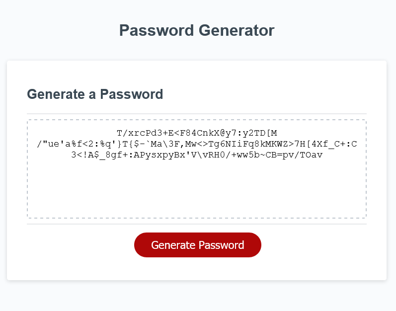

# hw03-password-generator

## Description

This is homework assignment 3

We were tasked with creating a script that generates a random password with user-chosen constraints.

It must be 8-128 characters long, and the user can choose any combination of uppercase letters, lowercase letters, numbers, and special characters.

## Site link

The link to the deployed application can be found **[https://nathanhentges.github.io/hw03-password-generator/](https://nathanhentges.github.io/hw03-password-generator/)**.

## Website preview

Below is a screenshot preview of the final website.

